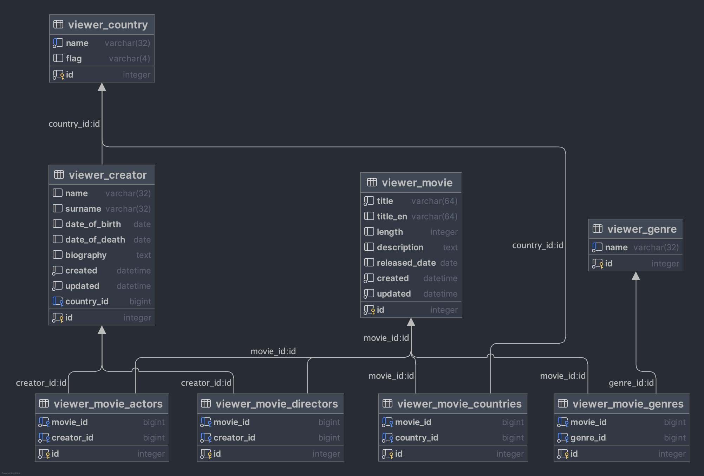

## Django Project - Filmová aplikácia

**Filmová aplikácia**

- Zobrazenie zoznamu filmov
- Zobrazenie detailov filmu (názov, žáner, ...)
- Správa filmov v databáze: pridanie, úprava, mazanie
- Zobrazenie zoznamu hercov a režisérov (tvorcovia)
- Zobrazenie detailu (biografia) herca/režiséra
- Správa tvorcov v databáze: pridanie, úprava, mazanie
- Filtrovanie podľa žánru, krajiny, režiséra, herca, roku
- Hľadanie - Filmy, herci, režiséri

-----

### Databáza

- [x] Genre
  - [x] name (String) 

- [x] Country
  - [x] name (String) 
  - [x] flag (Image?) 

- [x] Creator
  - [x] name (String)
  - [x] surname (String)
  - [x] country (-> Country)
  - [x] date_of_birth (Date)
  - [x] date_of_death (Date)
  - [x] biography (String) 
  - [ ] awards (n:m -> ??)
  - [x] acting (n:m -> Movie)
  - [x] directing (n:m -> Movie) 

- [x] Movie
  - [x] title_orig (String)
  - [x] title_cz (String)
  - [x] genres (n:m -> Genre)
  - [x] countries (n:m -> Country)
  - [x] length (Integer)
  - [x] actors (n:m -> Creator)
  - [x] directors (n:m -> Creator)
  - [x] description (String)
  - [x] released_date (Date)
  - [ ] rating (Float)
  - [ ] images (1:n -> Image)
  - [ ] video_url (String)

- [ ] Review
  - [ ] reviewer (-> User) 
  - [ ] movie (-> Movie)
  - [ ] rating (Integer, 1-5 hvězdiček)
  - [ ] comment (String) 
  - [ ] created (DateTime)
  - [ ] updated (DateTime) 

- [ ] User (default from Django)

- [ ] Image
  - [x] image (file)
  - [x] movie (-> Movie)
  - [ ] actors (n:m -> Creator)
  - [ ] description

-----

### Základy Djanga

05.03

#### Vytvorenie projektu
- Django projekt sa vytvára príkazom `django-admin startproject názov_projektu`
- Vytvorí sa základná adresárová štruktúra s konfiguračnými súbormi
- Hlavný konfiguračný súbor `settings.py` obsahuje nastavenia celého projektu
- Súbor `urls.py` definuje hlavné URL mapovanie aplikácie
- Súbor `wsgi.py` slúži na komunikáciu s webovým serverom

#### Návrh funkcionality
- Identifikácia hlavných funkcií aplikácie (pridávanie, editácia, zobrazenie filmov a tvorcov)
- Určenie vzťahov medzi entitami (filmy, tvorcovia, žánre, atď.)

#### Návrh databázy
- Identifikácia tabuliek (Film, Tvorca, Žáner, atď.)
- Definícia atribútov pre každú tabuľku (názov filmu, rok vydania, atď.)
- Určenie vzťahov medzi tabuľkami (ManyToMany, ForeignKey, OneToOne)

#### Vytvorenie aplikácie
- V rámci projektu môžeme vytvoriť viacero aplikácií príkazom `python manage.py startapp názov_aplikácie`
- Každá aplikácia je samostatný balík s vlastnou funkcionalitou
- Aplikáciu treba registrovať v `INSTALLED_APPS` v súbore `settings.py`
- Aplikácia obsahuje súbory ako `models.py`, `views.py`, `urls.py`, `admin.py`, `apps.py` a adresár `templates`

06.03

#### ORM modely
- Model predstavuje tabuľku v databáze a definuje sa v `models.py`
- Každý model je Python trieda, ktorá dedí od `django.db.models.Model`
- Polia modelov definujú stĺpce v databáze (CharField, IntegerField, DateField, atď.)
- Relácie medzi modelmi sa definujú pomocou ForeignKey, ManyToManyField, OneToOneField
- Modely môžu obsahovať metadáta, metódy a vlastnosti

#### Migrácie
- Migrácie slúžia na správu zmien v schéme databázy
- Vytvorenie migrácie: `python manage.py makemigrations`
- Aplikovanie migrácie: `python manage.py migrate`
- Migrácie umožňujú viesť históriu zmien v databáze
- Pomocou migrácie môžeme pridávať, meniť alebo mazať tabuľky a stĺpce
- Migrácie sa dajú vrátiť späť pomocou `python manage.py migrate app_name 0001`

#### Admin panel
- Django poskytuje automaticky generovaný admin panel
- Vytvorenie super užívateľa `python manage.py createsuperuser`
- Zaregistrovať modely do `admin.py` v aplikácií
- Registrácia modelov v `admin.py` pre zobrazenie v admin paneli

#### Shell
- Interaktívny Python shell s načítaným Django projektom: `python manage.py shell`
- Možnosť manipulácie s dátami bez webového rozhrania
- Testovanie ORM dotazov a operácií s modelmi
- Import modelov a práca s nimi priamo v shelli

Uložiť a načítať (DUMP/LOAD)
- Data môžeme exportovať z databáze `python manage.py dumpdata viewer --output fixtures.json`
- Data môžeme importovať do databázy `python manage.py loaddata fixtures.json`

10.03

#### Queries - dotazy
- Django ORM poskytuje API pre prácu s databázou
- Základné operácie: `objects.all()`, `objects.get()`, `objects.filter()`, `objects.exclude()`
  - `Movie.objects.filter(genres__name="Drama")`
  - `Movie.objects.filter(genres__name="Drama", released_date__year=1999)` 
- Porovnávacie operátory: `__exact`, `__contains`, `__startswith`, `__gt`, `__lt`, atď.
- Reťazenie dotazov (chaining): `Movie.objects.filter(rok__gt=2000).exclude(zanre__nazov="Horor")`
- Agregačné funkcie: `Count`, `Avg`, `Sum`, `Min`, `Max`
- Taktiež môžeme vytvoriť, editovať a vymazať z databazy
  - `Genre.objects.create(name='Dokument')`
  - `Movie.objects.filter(released_date__year=1994).update(length=123)`
  - `Genre.objects.get(name="Dokument").delete()`

#### Templates - šablóny
- Šablóny definujú vzhľad stránok v Django aplikácii
- Umiestnené v adresároch `templates` v aplikáciách
- Šablónový jazyk Django Template Language (DTL)
- Základné konštrukcie: premenné `{{ premenna }}`, bloky ``, podmienky ``, cykly ``
- Filtre pre formátovanie hodnôt: `{{ nazov|upper }}`, `{{ datum|date:"d.m.Y" }}`
- Dedičnosť šablón pomocou `` a `

#### Class-based views
- Zobrazenia implementované ako triedy namiesto funkcií
- Dedenie z tried ako `ListView`, `DetailView`, `CreateView`, `UpdateView`, `DeleteView`
- Jednoduchšie zdieľanie kódu medzi zobrazeniami
- Lepšie možnosti rozšírenia a prispôsobenia
- Jednoduchšia práca s formulármi a CRUD operáciami

11.-12.03

#### Formuláre
- Vytvorenie formulárov pre manipuláciu s dátami
- `ModelForm` je špeciálny typ formulára v Django, ktorý automaticky generuje formulárové polia podľa modelu.
- Umožňuje jednoduché vytváranie formulárov priamo z existujúcich modelov. Zjednodušuje validáciu a ukladanie dát.
- Kľúčové komponenty formulára: 
  - **trieda Meta** 
    - model (určuje, ktorý model sa použije ako základ formulára)
    - fields (definuje, ktoré polia z modelu budú zahrnuté do formulára)
    - labels (labels: umožňuje prepísať pôvodné menovky polí)
  - **validačné metódy**
    - špeciálne metódy pre validáciu konkrétnych polí pred celkovou validáciou (kontrola dátumov)
    - globálna validácia (clean()) pre validáciu závislostí medzi viacerými poľami
- Prispôsobenie vzhľadu formulárov pomocou CSS a widgetov

12.03

#### Filtrovanie
- Umožňuje zobraziť len podmnožinu dát na základe kritérií 
- Implementácia pomocou metódy get_queryset() v class-based views 
- Filtrovanie cez URL parametre: /filmy/?kategoria=komedia&rok=2023 
- Použitie Django ORM filtrov: Movie.objects.filter(category='komedia', year=2023)
- Možnosť kombinácie viacerých filtrov pomocou Q objektov: Q(category='komedia') | Q(category='drama')
- Filtrovanie v šablónach pomocou template tagov a filtrov

#### Vyhľadávanie
- Implementácia pomocou formulárov a class-based views 
- Vyhľadávanie v textových poliach pomocou icontains (case-insensitive): Movie.objects.filter(title__icontains=search_query)
- Vyhľadávanie vo viacerých poliach naraz pomocou Q objektov: Q(title__icontains=query) | Q(description__icontains=query)
- Možnosť vytvorenia pokročilého vyhľadávania s viacerými kritériami

24.03

#### Autentikácia
- Registrácia, prihlásenie (login), odhlásenie (logout), zmena hesla, reset hesla 
- Definovanie vlastnej login stránky a upravenie príslušnej šablóny 
- Predefinovanie user logout - zmena z formulára na jednoduchý odkaz 
- Vytvorenie prihlasovania pomocou vstavaných Django view funkcií 
- Vytvorenie profilu užívateľa pomocou modelu s väzbou OneToOneField na User model 
- Registračný formulár obsahujúci len vybrané položky z user modelu 
- Rozšírenie formulára o dodatočné položky pre profil 
- Použitie dekorátora @atomic v metóde save pre vytvorenie užívateľa aj profilu v jednej transakcii 
- Úprava šablón - zobrazovanie rôznych prvkov na stránke podľa stavu prihlásenia užívateľa

25.03

#### Autorizácia
- Implementácia pomocou PermissionRequiredMixins v class-based views 
- Vytvorenie vlastnej šablóny pre chybovú hlášku 403 (Forbidden)
- Podmienené zobrazovanie prvkov v šablóne na základe oprávnení (permission_required)
- Tvorenie a správa skupín užívateľov v administrátorskom rozhraní (editory, creators,...)
- Django poskytuje nástroje na testovanie oprávnení užívateľov 
- Kontrola oprávnení na úrovni views, modelov aj šablón

#### Review Feature
- Vytvorenie nového modelu Review s väzbou na modely Movie a Profile 
- Vytvorenie formulára s definovanými poľami pre hodnotenie 
- Vloženie formulára do šablóny filmu s podmienkou if_authenticated 
- Implementácia view pre spracovanie formulára
  - Logika pre update existujúceho review, ak užívateľ už film hodnotil 
- Vytvorenie šablóny pre zobrazenie recenzií 
- Využitie agregačných metód na výpočet celkového hodnotenia filmu (priemer, počet hodnotení)

#### Panel Správcu
- Úprava administrátorského rozhrania podľa potrieb projektu 
- Prispôsobenie formulárov pre jednoduchšiu správu dát 
- Pridanie vlastných filtrov a akcií 
- Úprava zobrazenia zoznamov a detailov modelov 
- Vytvorenie vlastných admin views pre špeciálne operácie 
- Priradenie oprávnení pre rôzne skupiny užívateľov v admin rozhraní

#### Images
- Inštalovať `Pillow` package
- ImageField pre modely, do settings a urls vložiť MEDIA_ROOT, MEDIA_URL
- Definovať formulár na pridávanie obrázkov s `enctype="multipart/form-data"`